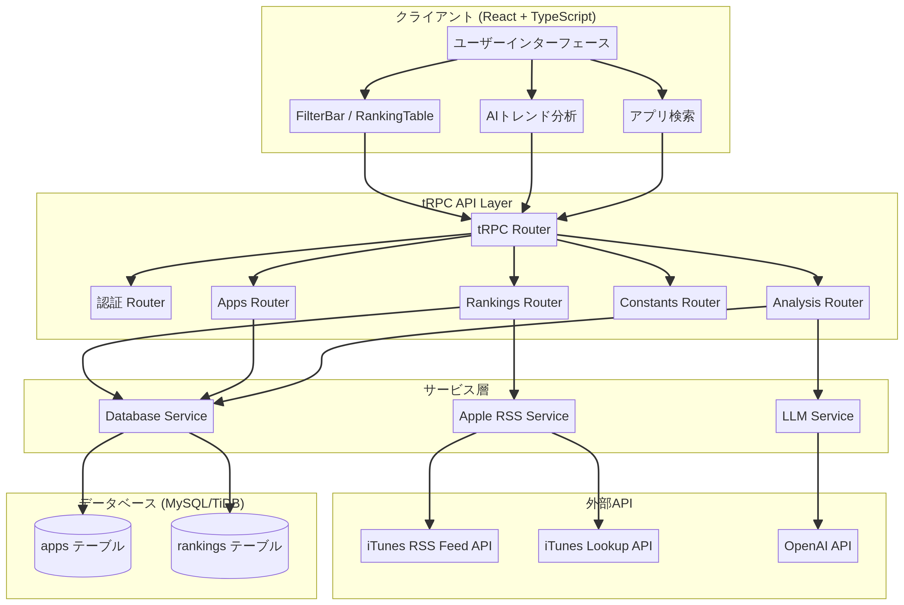

# AppRankNavi - App Store市場分析ダッシュボード


## 概要

**AppRankNavi**は、世界5カ国（日本、アメリカ、イギリス、中国、韓国）のApp Storeランキングをリアルタイムで比較・分析できるWebアプリケーションです。iTunes RSS Feed APIを活用し、トップセールス、トップ無料、トップ有料の各ランキングを18カテゴリにわたって取得・表示します。さらに、AIによるトレンド分析機能を搭載しており、市場動向を自動的に解析してレポートを生成します。

アプリ開発者、マーケター、投資家など、モバイルアプリ市場の動向を把握したいすべての方に向けて設計されています。

---

## 主な機能

### 1. マルチカントリーランキング比較

5カ国のApp Storeランキングを同時に表示し、アプリの国際的なパフォーマンスを一目で把握できます。各国のランキング順位を並べて表示することで、地域ごとの人気度の違いを視覚的に比較できます。

| 対応国 | 国コード | フラグ |
|--------|----------|--------|
| 日本 | JP | 🇯🇵 |
| アメリカ | US | 🇺🇸 |
| イギリス | GB | 🇬🇧 |
| 中国 | CN | 🇨🇳 |
| 韓国 | KR | 🇰🇷 |

### 2. カテゴリフィルタリング

iTunes RSS Feed APIのジャンルパラメータを活用し、18カテゴリでのフィルタリングが可能です。

| カテゴリ | ジャンルID | カテゴリ | ジャンルID |
|----------|------------|----------|------------|
| 総合 | - | ゲーム | 6014 |
| エンターテインメント | 6016 | SNS | 6005 |
| 写真/ビデオ | 6008 | ミュージック | 6011 |
| ライフスタイル | 6012 | ショッピング | 6024 |
| ヘルスケア/フィットネス | 6013 | ファイナンス | 6015 |
| 仕事効率化 | 6007 | ユーティリティ | 6002 |
| 教育 | 6017 | ビジネス | 6000 |
| ニュース | 6009 | 旅行 | 6003 |
| フード/ドリンク | 6023 | スポーツ | 6004 |

### 3. ランキングタイプ

3種類のランキングタイプに対応しています。

| ランキングタイプ | 説明 | APIフィードタイプ |
|------------------|------|-------------------|
| トップセールス | 売上ランキング | topgrossingapplications |
| トップ無料DL | 無料アプリダウンロード数ランキング | topfreeapplications |
| トップ有料DL | 有料アプリダウンロード数ランキング | toppaidapplications |

### 4. AIトレンド分析

OpenAI APIを活用したAIトレンド分析機能により、選択した国・カテゴリ・日付のランキングデータを自動的に分析し、以下の観点からレポートを生成します。

- 上位アプリの傾向と特徴
- カテゴリ別の市場動向
- 注目すべき新規参入アプリ
- 国際比較における特徴

### 5. アプリ検索

アプリ名での検索機能を提供し、特定のアプリが各国でどのような順位にランクインしているかを即座に確認できます。

### 6. 自動データ取得

毎日JST 7:00（UTC 22:00）に自動でランキングデータを取得し、履歴データとして蓄積します。これにより、過去のランキング推移を分析することが可能です。

---

## 技術仕様

### フロントエンド

| 技術 | バージョン | 用途 |
|------|------------|------|
| React | 19.x | UIフレームワーク |
| TypeScript | 5.x | 型安全な開発 |
| Tailwind CSS | 4.x | スタイリング |
| shadcn/ui | - | UIコンポーネントライブラリ |
| Wouter | - | クライアントサイドルーティング |
| TanStack Query | - | サーバー状態管理 |

### バックエンド

| 技術 | バージョン | 用途 |
|------|------------|------|
| Node.js | 22.x | ランタイム |
| Express | 4.x | HTTPサーバー |
| tRPC | 11.x | 型安全なAPI通信 |
| Drizzle ORM | - | データベースORM |
| Zod | - | スキーマバリデーション |

### データベース

| 技術 | 用途 |
|------|------|
| MySQL / TiDB | リレーショナルデータベース |

### 外部API

| API | 用途 | エンドポイント |
|-----|------|----------------|
| iTunes RSS Feed API | ランキングデータ取得 | `https://itunes.apple.com/{country}/rss/{feedType}/limit={limit}/genre={genreId}/json` |
| iTunes Lookup API | アプリ詳細情報取得 | `https://itunes.apple.com/lookup?id={appId}&country={country}` |
| OpenAI API | AIトレンド分析 | Manus Built-in API経由 |

---

## API仕様

AppRankNaviはtRPCを使用した型安全なAPIを提供しています。

### Rankings Router

#### `rankings.list`

ランキング一覧を取得します。

**入力パラメータ:**

```typescript
{
  countries: CountryCode[];      // 対象国（JP, US, GB, CN, KR）
  rankingType: RankingType;      // ランキングタイプ
  categoryType: CategoryType;    // カテゴリタイプ
  date: string;                  // 日付（YYYY-MM-DD形式）
  page: number;                  // ページ番号
  pageSize: number;              // 1ページあたりの件数（最大100）
}
```

**レスポンス:**

```typescript
{
  rankings: Array<{
    app: AppInfo;
    rankings: Record<CountryCode, number>;
  }>;
  total: number;
  page: number;
  pageSize: number;
  totalPages: number;
}
```

#### `rankings.fetch`

Apple RSS Feedから最新のランキングデータを取得し、データベースに保存します。

**入力パラメータ:**

```typescript
{
  country: CountryCode;
  rankingType: RankingType;
  categoryType: CategoryType;
}
```

#### `rankings.fetchAll`

全ての国・ランキングタイプのデータを一括取得します。

### Apps Router

#### `apps.search`

アプリ名で検索し、各国でのランキング情報を取得します。

**入力パラメータ:**

```typescript
{
  query: string;                 // 検索クエリ
  countries: CountryCode[];
  rankingType: RankingType;
  categoryType: CategoryType;
  date: string;
}
```

#### `apps.detail`

アプリの詳細情報を取得します。

#### `apps.rankingsAcrossCountries`

特定のアプリの各国でのランキング情報を取得します。

### Analysis Router

#### `analysis.trend`

AIによるトレンド分析を実行します。

**入力パラメータ:**

```typescript
{
  countries: CountryCode[];
  rankingType: RankingType;
  categoryType: CategoryType;
  date: string;
}
```

#### `analysis.comparison`

特定のアプリの国際比較分析を実行します。

### Constants Router

#### `constants.countries`

対応国一覧を取得します。

#### `constants.rankingTypes`

ランキングタイプ一覧を取得します。

#### `constants.categoryTypes`

カテゴリタイプ一覧を取得します。

---

## アーキテクチャ

AppRankNaviは、モダンなフルスタックアーキテクチャを採用しています。



### レイヤー構成

**クライアント層（React + TypeScript）**

ユーザーインターフェースを担当し、FilterBar、RankingTable、TrendAnalysis、SearchBarなどのコンポーネントで構成されています。tRPCクライアントを通じてバックエンドと型安全に通信します。

**API層（tRPC）**

型安全なAPIエンドポイントを提供します。Rankings、Apps、Analysis、Constantsの各Routerがビジネスロジックを処理します。

**サービス層**

外部APIとの通信やデータベース操作を抽象化します。Apple RSS Service、LLM Service、Database Serviceで構成されています。

**データ層（MySQL/TiDB）**

appsテーブルとrankingsテーブルでアプリ情報とランキング履歴を永続化します。

---

## データベーススキーマ

### apps テーブル

アプリの基本情報を格納します。

| カラム名 | 型 | 説明 |
|----------|-----|------|
| id | INT | 主キー |
| appStoreId | VARCHAR | App Store ID |
| bundleId | VARCHAR | バンドルID |
| name | VARCHAR | アプリ名 |
| artistName | VARCHAR | 開発者名 |
| artworkUrl100 | VARCHAR | アイコンURL（100px） |
| artworkUrl512 | VARCHAR | アイコンURL（512px） |
| summary | TEXT | アプリ説明 |
| categoryId | VARCHAR | カテゴリID |
| price | DECIMAL | 価格 |
| currency | VARCHAR | 通貨 |
| releaseDate | DATE | リリース日 |
| averageRating | DECIMAL | 平均評価 |
| ratingCount | INT | 評価数 |
| country | VARCHAR | 国コード |

### rankings テーブル

日次のランキングデータを格納します。

| カラム名 | 型 | 説明 |
|----------|-----|------|
| id | INT | 主キー |
| appId | INT | アプリID（外部キー） |
| country | ENUM | 国コード |
| rankingType | ENUM | ランキングタイプ |
| categoryType | ENUM | カテゴリタイプ |
| rank | INT | 順位 |
| rankDate | DATE | ランキング日付 |

---

## ディレクトリ構成

```
app-rank-navi/
├── client/                     # フロントエンド
│   ├── public/                 # 静的ファイル
│   │   └── og-image.png        # OGP画像
│   └── src/
│       ├── components/         # UIコンポーネント
│       │   ├── FilterBar.tsx   # フィルターバー
│       │   ├── RankingTable.tsx # ランキングテーブル
│       │   ├── TrendAnalysis.tsx # トレンド分析
│       │   ├── SearchBar.tsx   # 検索バー
│       │   └── ui/             # shadcn/uiコンポーネント
│       ├── pages/              # ページコンポーネント
│       │   └── Home.tsx        # ホームページ
│       ├── lib/
│       │   └── trpc.ts         # tRPCクライアント
│       └── App.tsx             # ルーティング
├── server/                     # バックエンド
│   ├── routers.ts              # tRPCルーター
│   ├── db.ts                   # データベースヘルパー
│   ├── appleRss.ts             # Apple RSS API連携
│   └── _core/                  # フレームワーク
│       ├── llm.ts              # LLM連携
│       └── trpc.ts             # tRPC設定
├── drizzle/                    # データベース
│   └── schema.ts               # スキーマ定義
├── shared/                     # 共有コード
│   └── rankings.ts             # 定数定義
└── docs/                       # ドキュメント
    └── architecture.png        # アーキテクチャ図
```

---

## 開発環境のセットアップ

### 前提条件

- Node.js 22.x 以上
- pnpm
- MySQL または TiDB

### インストール

```bash
# 依存関係のインストール
pnpm install

# データベースマイグレーション
pnpm db:push

# 開発サーバーの起動
pnpm dev
```

### 環境変数

以下の環境変数が必要です（Manusプラットフォームでは自動設定されます）。

| 変数名 | 説明 |
|--------|------|
| DATABASE_URL | データベース接続文字列 |
| JWT_SECRET | セッション署名用シークレット |
| BUILT_IN_FORGE_API_URL | Manus Built-in API URL |
| BUILT_IN_FORGE_API_KEY | Manus Built-in API キー |

---

## テスト

```bash
# テストの実行
pnpm test
```

Vitestを使用した単体テストが含まれています。

---

## ライセンス

このプロジェクトはプライベートプロジェクトです。

---

## 作成者

**Manus AI**

---

## 参考資料

- [Apple RSS Feed Generator](https://rss.marketingtools.apple.com/) - Apple公式のRSS Feed Generator
- [iTunes Search API](https://developer.apple.com/library/archive/documentation/AudioVideo/Conceptual/iTuneSearchAPI/) - iTunes Search API ドキュメント
- [tRPC Documentation](https://trpc.io/docs) - tRPC公式ドキュメント
- [Drizzle ORM](https://orm.drizzle.team/) - Drizzle ORM公式サイト
